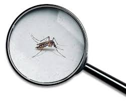
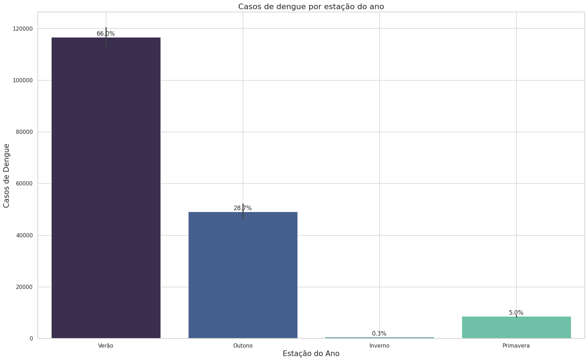
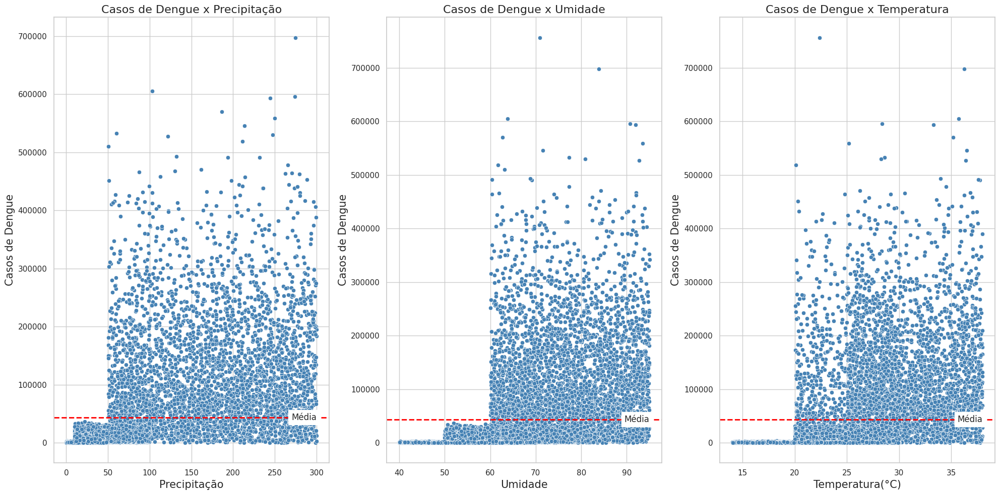
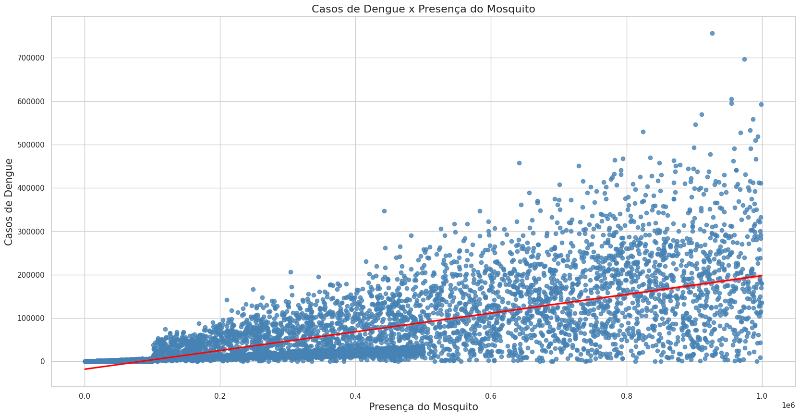
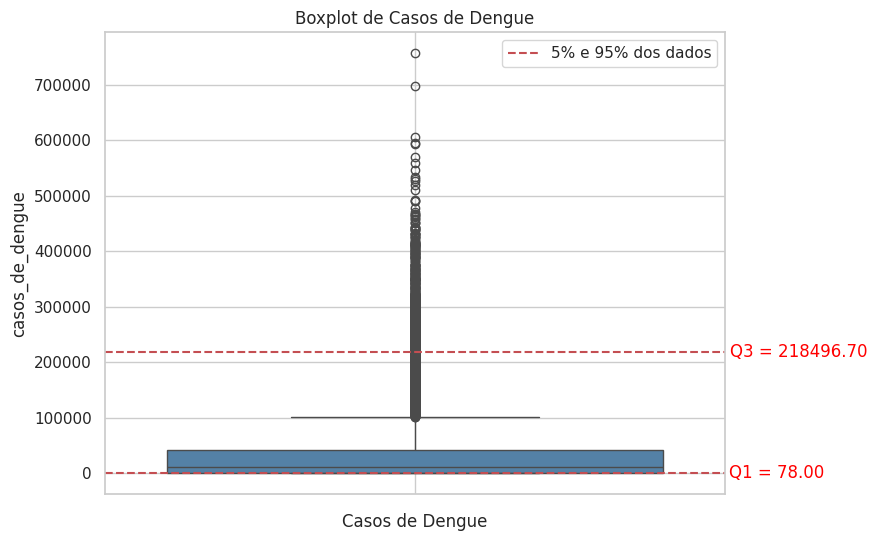

# 
 Previsão Casos de Dengue 

 

## Contribuidores

- [Adriane Akemi Yamaguti](https://github.com/AdrianeAkemi)
- [Daniel Salvatori](https://github.com/Daniel-Salvatori)
- [Giovano Montemezzo Panatta](https://github.com/GiovanoMP)

 

## 1. Problema de negócio
A dengue é uma doença viral transmitida principalmente pelo mosquito Aedes aegypti e representa um desafio significativo para a saúde pública devido à sua rápida disseminação e impacto na população.

As possíveis razões para o aumento dos casos de dengue podem incluir fatores como condições climáticas favoráveis à reprodução do mosquito transmissor (como temperaturas elevadas e alta umidade), acúmulo de água parada em recipientes (criadouros), densidade populacional, falta de saneamento básico, falhas na aplicação de medidas de controle do vetor, entre outros. Além disso, a interação desses fatores pode variar de acordo com as diferentes regiões geográficas do Brasil.

## 2. Objetivo
O objetivo deste projeto é desenvolver um modelo de previsão capaz de estimar o número de casos de dengue para os próximos 1500 dias. Esse modelo visa fornecer informações valiosas para autoridades de saúde pública, instituições médicas e governamentais, permitindo a implementação de medidas preventivas e estratégias de combate mais eficazes.

Este trabalho foi realizado na oitava edição do Hackday proposto pela [Comunidade DS](https://www.comunidadeds.com/). O evento foi realizado nos dias 27 e 28/04/2024 e reuniu os alunos divididos em equipes, cujo objetivo era criar uma solução para o problema exposto. Abaixo voce pode conferir como foi o planejamento e execução realizado pela nossa equipe (10ESPERADOS).

Maiores informações podem ser conferidas através do link da [competição](https://www.kaggle.com/competitions/8-hackday-comunidadeds/overview).

## 3. Descrição dos dados
Os dados foram disponibilizados em um banco de dados PostgreSQL divididos em 6 tabelas. Após a união de todas elas obtivemos o seguinte conjunto de dados:

| Variável                        | Descrição                                        |
|----------------------------------------|--------------------------------------------------|
| Date                                   | Data das informações                              |
| Presença de Criadouros                 | Porcentagem da área com presença de mosquitos   |
| Falta de Coleta de Lixo                | Taxa de coleta de lixo realizada                 |
| Água Parada em Terrenos Baldios        | Porcentagem da área com presença de água parada  |
| Presença de Piscinas sem Manutenção    | Número de piscinas sem manutenção observadas      |
| Área com Acúmulo de Entulho            | Porcentagem da área com entulho                  |
| Conscientização da População           | Nível de conscientização sobre a dengue          |
| Condições de Moradia Precárias         | Taxa de moradias precárias na área observada      |
| Falta de Acesso a Serviços de Saúde    | Taxa de moradores sem acesso a serviços de saúde |
| Migração de Pessoas de Áreas Endêmicas | Taxa de migração entre áreas                     |
| Transporte de Mercadorias em Áreas Urbanas | Porcentagem de veículos de transporte de cargas |
| Falta de Controle de Pragas            | Porcentagem da área observada sem controle de pragas |
| Presença de Recipientes sem Tampas     | Número de recipientes observados no dia          |
| Precipitação                           | Água proveniente do vapor de água atmosférica depositada na superfície |
| Taxa de Tratamento de Esgoto           | Porcentagem de esgoto não tratado na área observada |
| Umidade                                | Relação entre a pressão parcial da água contida no ar e a pressão de vapor da água à temperatura do ar |
| Temperatura                            | Calor da atmosfera, medido em graus Celsius (ºC) |
| Presença de mosquito                   | Quantidade de mosquitos observada                |
| Casos de dengue                        | Total de número de casos observados no dia       |

## 4. Planejamento da solução
Para desenvolvimento da solução foi utilizado o processo de modelagem chamado CRISP-DM. Sua natureza cíclica permite não só a refatoração do código como também a formulação de outras hipóteses e melhora dos modelos ao longo de cada ciclo.

### 4.1 Ferramentas

* Python 3.10.12
* Visual Studio Code
* Git e Github
* SQL e PostgreSQL
* Algoritmos de regressão(LGBMRegressor)
* Hyperparameter Fine Tuning (Optuna)
* Técnicas de redução de dimensionalidade (PCA)

### 4.2 Processos

**4.1.1 Entendimento do negócio:** Nessa etapa inicial é fundamental identificar os objetivos do negócio e entender como a empresa atua no mercado.

**4.1.2 Descrição dos dados:** Coletar os dados e compreender o significado de cada atributo. Utilizar métricas estatísticas para fornecer uma visão geral, renomear colunas, identificar e tratar dados nulos e duplicados, padronizar os tipos dos dados.

**4.1.3 Feature engineering:** Derivar novos atributos com base nas variáveis originais visando melhor descrever o fenômeno a ser modelado.

**4.1.4 Análise Exploratória de Dados (EDA):**

- **Análise Univariada:** Analisar as variáveis individualmente verificando possíveis outliers inconsistentes, a fim de filtrá-los ao longo dos próximos ciclos.

- **Análise Bivariada:** Observar a relação das variáveis com a variavel resposta, buscando encontrar padrões que possam ser úteis no desenvolvimento de nosso modelo.
  
- **Análise Multivariada:** Observar a relação entre todas as  variáveis.

**4.1.5 Filtragem dos dados:** Etapa onde será filtrado os dados retirando algumas inconsistência que podem atrapalhar o desempenhon de nosso modelo.

**4.1.6 Seleção de atributos:** Seleção de atributos mais significativos para o treinamento do modelo.

**4.1.7 Preparação dos dados:** Aplicar transformações nas features, facilitando o aprendizado dos modelos.

**4.1.9 Machine Learning Modeling / Hyperparameter Fine Tuning :** Treinamento do modelo de aprendizado de máquina. Utilizamos o framework Optuna nessa etapa para melhor ajuste dos parâmetros.

## 5. Insights

### 5.1 Sazonalidade
A partir de nossas análises identificamos que os casos de dengue tendem a aumentar significativamente no verão. Isso porque o calor e a umidade criam um ambiente ideal para a reprodução do mosquito. Além disso as chuvas frequentes nesse período podem resultar no acúmulo de água em recipientes ao ar livre, como pneus, vasos de plantas, recipientes de água e outros locais propícios para a reprodução do mosquito.

 

 

### 5.2 Clima
A medida que a umidade, volume de precipitação e temperaturas aumentam, os casos de dengue acompanham a mesma tendência. 
A linha vermelha indica a média dos casos de dengue, podemos constatar visualmente como os dados climáticos influenciam diretamente em nossa variável resposta.

 

 

### 5.3 Presença do mosquito
Traçamos uma reta de regressão para representar a relação entre as duas variáveis. Podemos notar que a reta é ascendente o que indica uma relação positiva, ou seja, a medida que a presença do mosquito aumenta, os casos de dengue também aumentam.
 

 

### 5.4 Variável Alvo

Identificamos em nossa análise exploratória, que nossa variável target contém muitos outliers. Aqui filtramos nosso dataset para que fosse selecionado apenas valores com no máximo 217000 casos, ligeiramente abaixo do quartil 95%. Reconhecemos que esses valores extremos têm o potencial de distorcer a interpretação dos resultados. Não estamos sugerindo que esses valores sejam incorretos, mas sim que representam comportamentos atípicos que podem impactar diretamente os resultados do nosso modelo.
   

 

## 6. Modelos de Machine Learning

### 6.1 Métrica

**RMSE (root mean squared error):** é a medida que calcula "a raiz quadrática média" dos erros entre valores observados (reais) e predições (hipóteses).Para calcular, basta tirar a raiz quadrada da média dos erros quadrados, conforme a fórmula abaixo:

$$
\text{RMSE} = \sqrt{\frac{1}{n} \sum_{i=1}^{n} (y_i - \hat{y}_i)^2}
$$

**Legenda:**
- n: número total de observações.
- y_i: valores reais.
- y_hat_i: valores previstos pelo modelo.

### 6.2 Modelos

**Média :** Utilizamos a média de todos os valores como baseline para comparação.

**LGBMRegressor :** O LGBMRegressor utiliza a técnica de aumento de gradiente (gradient boosting) para construir um conjunto de árvores de decisão que preveem um valor numérico (regressão) com base em um conjunto de características (features). Ele funciona treinando árvores de decisão sequencialmente, onde cada nova árvore corrige os erros dos modelos anteriores. Destaca-se pela eficiência e precisão nos resultados.

### 6.3 Performance

Nosso modelo escolhido foi o LGBMRegressor, ele performou 33.26% melhor que nosso baseline.

 

|Modelo          | RMSE        |
|--------------- |-------------|
|Média (baseline)| 48200.8084  | 
|LGBMRegressor   | 32169.0867  |

## 7. Conclusão

Com um modelo treinado, obtemos uma previsão mais precisa dos casos de dengue para os próximos anos, permitindo ao governo antecipar e planejar suas intervenções de saúde pública com maior eficácia. 

Além disso, as análises e resultados fornecidos pelo modelo capacitam o governo a direcionar melhor os recursos da saúde, garantindo um uso mais eficiente dos fundos disponíveis e uma resposta mais ágil em períodos críticos, como é o caso do verão.

Medidas de prevenção devem ser intensificadas para que a população se conscientize e promova comportamentos que auxiliem na redução dos casos.

## 8. Próximos Passos

- Testar novos algoritmos

- Obter dados de geolocalização para identificar regiões com maior incidência de casos.

- Realizar novos ciclos e criar novas features que ajudem a explicar melhor o fenômeno. 
